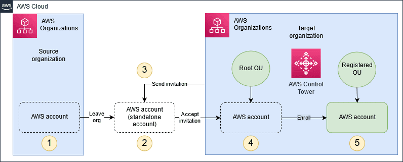

# AWS Account Migration Notes

[Link to official docs](https://docs.aws.amazon.com/prescriptive-guidance/latest/patterns/migrate-an-aws-member-account-from-aws-organizations-to-aws-control-tower.html)

# Assess

- Integration with other services might be disabled. If you remove an account from an organization that has integration with an AWS service enabled, the users in that account can no longer use that service.

```bash
aws organizations list-aws-service-access-for-organization
```

- When a member account leaves an organization, all tags attached to the account are deleted. Back these up.

```bash
aws organizations list-tags-for-resource --resource-id <account-id>
```

- Each member account needs to be able to run as standalone account. As such it will require billing information.

> Typically, if you created the member account by using the AWS Organizations console, API, or AWS Command Line Interface (CLI) commands, the information required of standalone accounts isn't automatically collected. To add this information, sign in to the account, and specify a support plan, contact information, and a payment method.

- The principals in the account are no longer affected by any policies that applied in the organization. This means that restrictions imposed by SCPs are gone, and the users and roles in the account might have more permissions than they had before. Other organization policy types can no longer be enforced or processed.

```bash
# Export a list of Service Control Policies (SCPs) targeting an account managed by AWS Organizations.
account_id=<account-id>
aws organizations list-policies-for-target --target-id $account_id --filter SERVICE_CONTROL_POLICY --query 'Policies[*].Id' --output text | while read policy_id; do
  echo "Policy ID: $policy_id"
  aws organizations describe-policy --policy-id $policy_id
done
```

- The Assessment Tool does not verify that any underlying resource-based policies are still correct. It’s the account owners’ responsibility to verify policies work as intended before starting the migration, using existing services such as AWS Identity Access Manager and Access Analyser. Great care should be taken when reviewing condition policy elements and **managers should avoid deleting conditions until they understand how it will impact account functionality**.

```bash
# List any account resource-based policies with condition policy elements
aws iam list-policies --scope Local --query 'Policies[*].Arn' --output text | while read policy_arn; do
  policy_version=$(aws iam get-policy --policy-arn $policy_arn --query 'Policy.DefaultVersionId' --output text)
  policy_conditions=$(aws iam get-policy-version --policy-arn $policy_arn --version-id $policy_version --query 'PolicyVersion.Document.Statement[?Condition]' --output json)
  if [ "$policy_conditions" != "[]" ]; then
    echo "Policy ARN: $policy_arn"
    echo "Conditions: $policy_conditions"
  fi
done
```

## Sharing Resource Access Management

Users will need to share resources using AWS Resource Access Management (RAM) to create a resource share. A resource share has a list of one or more AWS resources to be shared, a list of one or more principals to whom access to the resources is granted, and managed permissions for each type of resource that is included in the share. After creating a resource share, the principals specified in the resource share can be granted access to the share’s resources. An organization can share resources with accounts both inside and outside the organization, but accounts from within will receive those permissions much sooner, which accounts get those resources is simpler to control, and external access will depend on if the resource type supports external access.

Sharing resources is done through the AWS RAM console or AWS Command Line Interface (CLI) to enable sharing with AWS Organizations. When sharing inside an organization, AWS RAM doesn’t send invitations to principals. Principals in the organization gain access to shared resources without exchanging invitations. When sharing resources with the entire organization or OUs is no longer necessary, it is as simple as disabling resource sharing.

# Migrate



## Step 1: Move Everything Out

All accounts that will be moved will each need to receive invitations to the new OU. There are quotas for the maximum number of invitations allowed on an account, so this process will take a considerable amount of time. Each account that does receive an invitation must leave their previous organization first before accepting the invitation and will have fifteen days after receiving the invitation before it expires. Do not forget that in order for an account to be removed from an organization, it must have all the necessary data to function independently. When the invitation is accepted, the account will be placed at the root of the organization and must be implemented into the OU manually. Production developers will be moved to the new account’s Control Tower.

## Step 2: Decommissioning and Clean Up

At this point, there is no reason to keep any older infrastructure. Deleting any old OUs can only be done once any accounts on it have been moved out. When deleting an organization, the previous management AWS account will be excised, the rest of the organization is discarded, and the account is now converted into a standalone account. Any policies remaining in the organization will be deleted with it. Prior to deleting an organization, be careful of closing any member accounts as doing so will place those accounts in a suspended status for up to three months, preventing the organization from being deleted.

## Step 3: Continued Use of the Manager Account

After the manager account is removed, there is still plenty that can be done with it. Based on the users’ choice, it will be converted into a standalone account, used to create a new organization, or invited to the destination organization. Some services for the former manager’s account might be disabled because those services require an organization to work with. However, the account is no longer responsible for managing expenditures of AWS resources aside from its own. For the sake of this tutorial, the primary action will be the third option mentioned above.

## Step 4: Invite the Former Manager Account

Make sure all previous steps are fully met first and that the monthly billing for the previous month is completed. Same as all the other accounts, invite the manager account in as a new member to the organization.

# Validation and Verification

All that is left is to make sure the protocols and policies still work in the new organization. Even if planning was done thoroughly in advance, now would be a good time to check that all procedures still work with the new accounts brought on board. Since all the accounts that were migrated are unorganized at the root, they will need to be manually sorted into the hierarchy of the new OU. Ideally, if all steps were taken to prepare and move all needed components to the new OU, everything should work upon completion of the migration.
